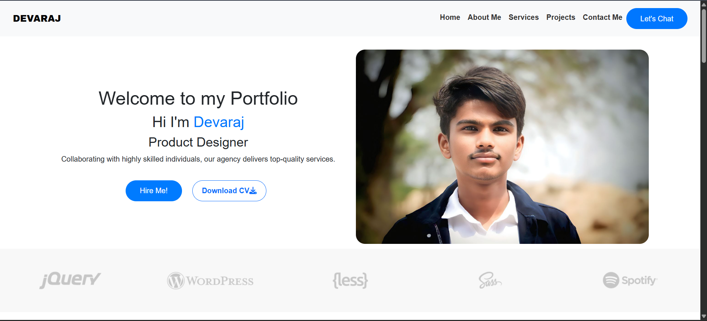

# 🌐 Modern Portfolio

A modern, clean, and fully responsive **personal portfolio website** built to highlight your work, skills, and achievements. Optimized for all devices and deployed with GitHub Pages.

> ⚡ Built with HTML, CSS, and JavaScript — lightweight and fast with no external frameworks.

---

## 🌟 Features

- 🧑‍💼 Professional "About Me" section
- 💼 Project portfolio grid with live links
- 📫 Contact section with direct links
- 📱 Fully responsive design
- 🎨 Modern and aesthetic layout

---

## 🖥️ Tech Stack

- ✅ **HTML5**  
- ✅ **CSS3** — grid layout, media queries  
- ✅ **JavaScript** — dynamic behavior and interactivity  

---

## 📸 Screenshots

| Desktop View | Mobile View |
|--------------|-------------|
|  |  |

---

## 🚀 Live Preview

🔗 [**Visit Live Site**](https://devarajb049.github.io/devarajportfolio/)

---

## 📂 How to Use

### 🔧 Setup Steps

1. **Clone the Repository**:
   ```bash
   git clone https://github.com/Devarajb049/devarajportfolio.git
   cd devarajportfolio
